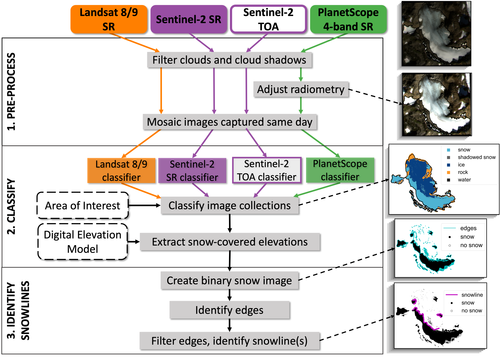
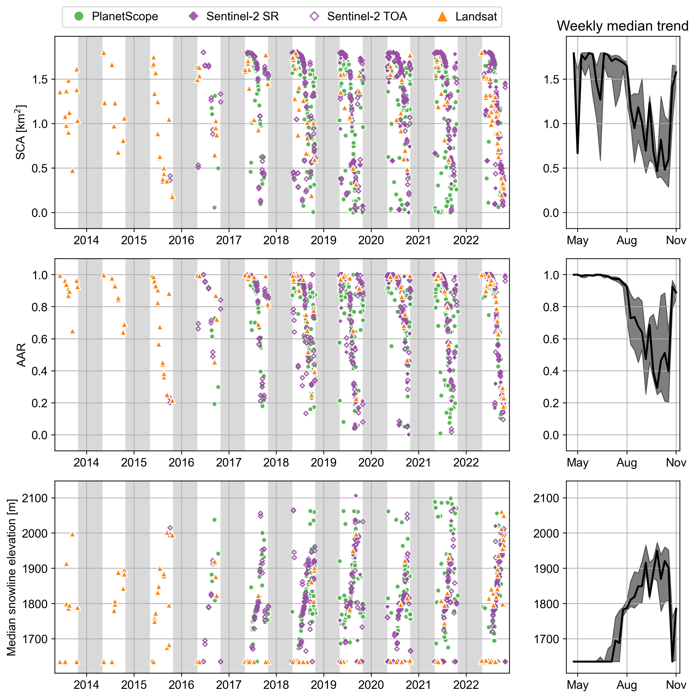

# glacier-snow-cover-mapping

[Rainey Aberle](https://github.com/RaineyAbe) and [Ellyn Enderlin](https://github.com/ellynenderlin), Department of Geosciences, Boise State University

## Correspondence
Rainey Aberle (raineyaberle@u.boisestate.edu)

## Description
Workflow and tools for detecting snow-covered area, accumulation area ratio, and seasonal snowlines on mountain glaciers using Landsat 8/9, PlanetScope, and Sentinel-2 imagery.

__Basic image processing workflow:__

## Requirements

1. __Google Earth Engine account__ to access Landsat and Sentinel-2 imagery. [Sign up here](https://earthengine.google.com/new_signup/).
2. (Optional) __Planet account__ ([sign up here](https://www.planet.com/signup/)) with access to PlanetScope imagery through the NASA Commercial SmallSat Data Acquisition program ([apply here](https://www.planet.com/markets/nasa/)). It may take time for your account to be approved for free PlanetScope images access.
3. __Shapefile__ containing a polygon of your area of interest (AOI). This is used for querying imagery from Google Earth Engine and/or Planet Labs, Inc. and cropping images before classifying.
4. (Optional) __Digital elevation model (DEM)__. If you do not specify a DEM in your directory, the workflow will automatically use the ArcticDEM Mosaic where there is coverage and the NASADEM otherwise.

## Installation
Please see the [Installation Instructions](https://github.com/RaineyAbe/snow-cover-mapping/blob/main/docs/installation_instructions.md).

## Basic Workflow
Please see the [Basic Workflow Instructions](https://github.com/RaineyAbe/snow-cover-mapping/blob/main/docs/basic_workflow.md).

## Citation

Aberle, R., Enderlin, E., O'Neel, S., Marshall., H.P., Florentine, C., Sass, L., and Dickson, A. (_in prep_) Automated snow cover detection on mountain glaciers using space-borne imagery.

DOI via Zenodo for this GitHub repository coming soon.

## Image classifiers development
- __Image classifiers__ are located in the `inputs-outputs/` folder with the following naming convention: `{IMAGE PRODUCT}_classifier_all_sites.joblib`. Refer to `notebooks/develop_classifiers.ipynb` for the code used to train and select the optimal classifier for each image product.

- __Feature columns:__ The image bands used as predictors by each classifier are located in the `inputs-outputs/` folder with the following naming convention: `{IMAGE PRODUCT}_feature_columns.json`.

- __Training data:__ The classifiers were trained using manually classified points at the USGS Benchmark Glaciers. Data tables of the reflectance values sampled at each manually classified point are located in the `inputs-outputs/models_training_data/` folder with the following naming convention: `{IMAGE PRODUCT}_training_data.csv`. Points were categorized into the following categories, as are the resulting classified images:
  1.  Snow
  2. Shadowed snow
  3. Ice
  4. Rock/debris
  5. Water

## Performance assessment
The snow detection workflow was assessed by comparing automated snow cover maps and snowlines to manual image observations.

  - Snow cover maps were compared to manually classified points at Lemon Creek and Emmons glacier, which were excluded from the models training data. Data tables of the manually classified validation points are available in the `inputs-outputs/models_validation_data/manually_classified_points/` folder with the following naming convention: `{IMAGE PRODUCT}_manually_classified_points.csv`.

  - Automatically detected snowlines were compared to manually delineated and digitized snowlines and are available in the `inputs-outputs/models_validation_data/manually_digitized_snowlines/` folder as shapefiles with the following naming convention: `{SITE NAME}_{IMAGE DATE}_{IMAGE PRODUCT}_manually_digitized_snowline`.

## Example results
Below are an example time series of snow-covered area (SCA), accumulation area ratio (AAR), and median snowline elevations at South Cascade Glacier, Washington state for 2013--2022.

__Classified images and seasonal snowlines__

__Snow cover metrics time series and weekly median trends__

Weekly median trends are excluding PlanetScope to mitigate noise.

## Funding and Acknowledgements
We would like to thank members of the [CryoGARS Glaciology](https://github.com/CryoGARS-Glaciology) lab at Boise State University and the [USGS Benchmark Glacier program](https://www.usgs.gov/programs/climate-research-and-development-program/science/usgs-benchmark-glacier-project) staff for their support and input. This work was funded by BAA-CRREL award W913E520C0017, NASA EPSCoR award 80NSSC20M0222, the SMART Scholarship, and the Idaho Space Grant Consortium. The workflow uses data from [Planet Labs, Inc.](https://www.planet.com/) which was made available through the [NASA Commercial Smallsat Data Acquisition (CSDA) Program](https://www.earthdata.nasa.gov/esds/csda).

Several open packages made the integration of this Python-based workflow with Google Earth Engine possible. Thank you to the developers of [geemap](https://geemap.org/), [geedim](https://geedim.readthedocs.io/en/latest/index.html), and [wxee](https://wxee.readthedocs.io/en/latest/index.html).
